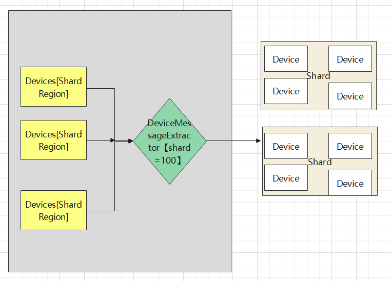

# akka classic cluster sample

2022-4-13日，akka集群技术分享的示例。

[Slides Download](https://github.com/xiaozhiliaoo/my-slides/blob/master/akka-classic-cluster.pptx)

## Demo1 动态变化的集群动画

演示集群间的状态变化的动画。 操作命令如下，首先启动9个节点。

```
sh cluster-start
sh node-stop 4
sh node-down 5
sh node-start 5
任务管理器杀掉Java进程
sh node-start 4
sh node-start 5
sh cluster-stop
```

## Demo2 集群成员变更事件通知/演示JMX

通过代码演示集群事件变更通知，同时通过JMX查看Cluster暴露的MBean

在demo2包下，依次启动SimpleClusterStarter1,SimpleClusterStarter2,SimpleClusterStarter3,观察节点事件变化

## Demo3 Classic Distributed Data

在demo3包下，分布式数据，案例包括分布式缓存，分布式指标，服务注册，购物车，投票服务.

## Demo4 Classic Cluster Singleton

在demo4包下，依次启动StartBackend，StartBackend2，StartBackend3，会发现只有一个SingletonActor启动成功.

## Demo5 Classic Cluster Publish Subscribe

在demo5包下，依次启动三个订阅者Subscriber，Subscriber2，Subscriber3，然后启动发布者发布消息，观察订阅者收到消息。

## Demo6 Classic Cluster Sharding

在demo6/device包下，一个温度记录仪的例子. 依次启动ShardingApp，ShardingApp2，ShardingApp3，观察Device的输出.





## Demo7 Gossip Animation Simulator

演示Gossip协议的动画.

## Demo8 Phi Accrual Failure Detector

在demo8包下面，HealthChecker的例子展示了PFD.